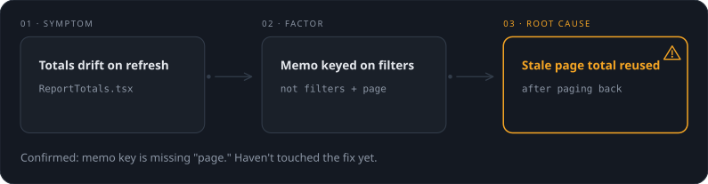

# visualize-skills

Three [Claude Code](https://claude.com/claude-code) skills, one house style, covering the diagnose → propose → resolve lifecycle: **visualize-the-problem** diagrams a confirmed bug or incident, **visualize-the-plan** diagrams a proposed fix before you build it, and **visualize-the-fix** diagrams a just-finished coding task. All three trade a wall of text for a small, proportional diagram.

Some people read diagnoses, plans, and changes fastest as prose. Others get there faster from a picture — a cause chain, a before/after, a sequence — and lose time wading through paragraphs to reconstruct what a three-node diagram would have shown instantly. These skills are for the second group: they read the investigation, the plan, or the diff, pick the smallest diagram shape that actually fits, and skip the long-form recap.

## visualize-the-problem

The diagnostic first step. Reads a confirmed diagnosis — right after investigating a bug or incident, before proposing a fix — and classifies it into one of six shapes: a trivial problem, a single-system or cross-system symptom chain, a reproduction sequence when the order of steps to trigger the bug matters, a hypothesis fork for when the root cause isn't confirmed yet and there are real competing theories, or a mechanism deep dive for when you're asked *why* the bug happens. Nothing here is marked "done" or "planned" — the confirmed root cause gets a solid (not dashed, not filled) accent outline with a small warning mark, distinct from both siblings' treatments.

A bug traced to its root cause, not yet fixed:



Triggers right after diagnosing a bug or incident, or on request: "explain the bug," "visualize the problem," "what's going wrong here," or "why does this fail" for the mechanism-deep-dive shape.

## visualize-the-plan

The proposal step. Reads a just-formed plan — typically right before it's presented for approval — and classifies it into one of six shapes: linear steps, a phased plan grouped into milestones, a Now/Planned scope map for plans that are really about which files will change, a decision fork for plans that hinge on a real choice, a rationale deep dive for when you're asked *why* an approach was chosen, or a trivial plan. Same 8-node cap, same house style — but nothing in these diagrams is marked "done," since nothing has been built yet: the plan's target gets a dashed accent outline and a small target mark instead of the solid fill and check tick that `visualize-the-fix` reserves for finished work.

A three-step plan, shown before any of it is built:


Triggers right before presenting a plan for approval (e.g. before exiting plan mode), or on request: "visualize the plan," "diagram this plan," "what's the plan?"

## visualize-the-fix

The resolution step. Reads the diff, classifies it into one of six shapes — trivial fix, single-system cause chain, cross-system cause chain, before/after refactor, sequence flow, or a vertical deep dive (cause → fix → why it works, for when you ask *why* a fix works rather than just what changed) — and renders 2–8 nodes sized to match the change. No shape is picked without a diff to justify it, and no diagram exceeds 8 nodes regardless of how big the change was.

A retry bug fixed in three lines, explained as a causal chain instead of a paragraph:


Triggers automatically once a coding task finishes, or on request: "explain what you just did," "visualize the fix," "show me what changed," or "why does this fix work" for the deep-dive shape.

## Install

**As a plugin (recommended):**
```
/plugin marketplace add Chndr-3/visualize-skills
/plugin install visualize-skills
```
Installing the plugin gives you all three skills.

**Manually:** drop `skills/visualize-the-problem`, `skills/visualize-the-plan`, and/or `skills/visualize-the-fix` into your Claude Code skills folder (e.g. `~/.claude/skills/`).

Also ships a `.codex-plugin/plugin.json` manifest for installing into [Codex CLI](https://github.com/openai/codex).

## How it renders

Its own house style — no dependency on `diagram-design` or any other skill. Inline SVG + CSS, self-contained HTML, no external assets, no JavaScript:

- **Drafting-table look**: dark mode by default (CSS-only toggle to light, bottom-right), dot-grid background, hairline strokes, monospace subtitles for file:line references. Amber is reserved, and each skill gives its single reserved-color node treatment a different meaning: in `visualize-the-fix` it marks the node that resolves the diff (solid fill + check tick, "done"); in `visualize-the-plan` it marks the node a plan is aiming at (dashed outline + target mark, "proposed, not built"); in `visualize-the-problem` it marks the confirmed root cause (solid outline, no fill, warning mark, "real and unresolved").
- **Clickable glossary**: technical terms in a diagram (checked against each skill's own `references/glossary.md`) open a small modal on click, which falls through to a collapsible drawer listing every term used, highlighted with a soft wash animation instead of a flat color block.
- **Text sizing**: box widths and line-wrapping are computed per diagram, not copied from a fixed template — see each skill's `references/renderer.md` for the sizing pass.

Each skill carries its own copy of the house style (`references/style-reference.html` is the canonical working example for that skill's shapes) so any of them can be installed independently. `skills/visualize-the-problem/references/style-reference.html`, `skills/visualize-the-plan/references/style-reference.html`, and `skills/visualize-the-fix/references/style-reference.html` are the canonical working examples — open any directly in a browser to see the current look. See each skill's `SKILL.md` for its shape-classification table.

## Contributing

See `CONTRIBUTING.md`. Bugs and feature requests: [GitHub issues](https://github.com/Chndr-3/visualize-skills/issues). Security issues: see `SECURITY.md` (please don't file those as public issues).

## License

MIT — see `LICENSE`.
